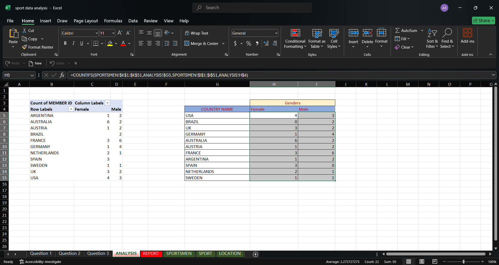
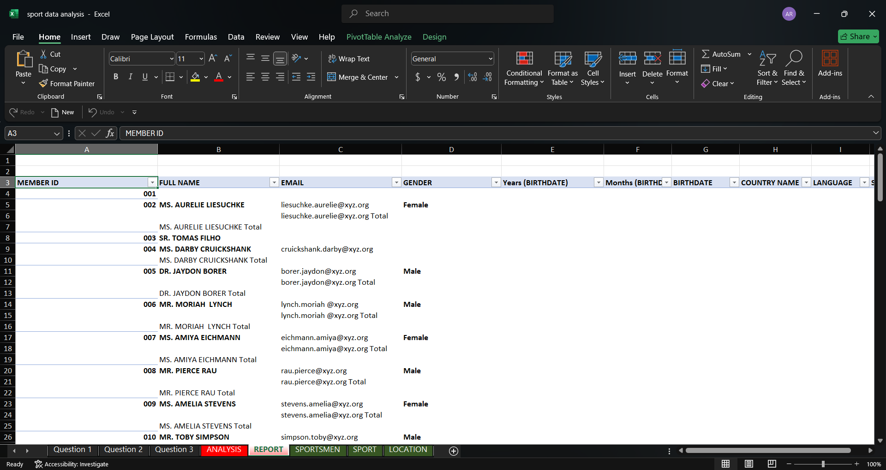

# sports-data-analysis-excel
# Sports Data Analysis using Excel

## Project Overview
This project analyzes sportsmen membership data for an international sports event organization. The objective of this project is to clean the dataset, perform analysis, and generate reports using Microsoft Excel.

## Tools Used
- Microsoft Excel
- Pivot Tables
- Excel Functions
- Data Cleaning Techniques

## Project Stages

### Stage 1: Data Cleaning
- Generated FULLNAME column in standardized format
- Extracted COUNTRY NAME using lookup from the LOCATION sheet
- Populated LANGUAGE spoken by each sportsman
- Generated EMAIL addresses using required format
- Populated SPORT LOCATION using data from SPORT sheet

### Stage 2: Data Formatting
- Formatted MEMBER ID as a 3-digit number
- Converted BIRTHDATE into `dd-mmm-yyyy` format
- Displayed WEIGHT with units (kg)
- Formatted SALARY values in thousands (k)

### Stage 3: Data Analysis
- Created Pivot Table to analyze sportsmen by **Country and Gender**
- Counted number of candidates from each country
- Generated summary tables using Excel functions

### Stage 4: Report Generation
- Created Pivot Table report
- Changed layout to **Tabular Form**
- Removed **Grand Totals**
- Added **Sport Location Filter** for interactive analysis

## Project Files
- Excel Dataset containing cleaned data and analysis
- Pivot Analysis sheet
- Final Report sheet

## Screenshots

### Data Cleaning

### Pivot Analysis

### Final Report

## Author
**Anurag Ranjan**
